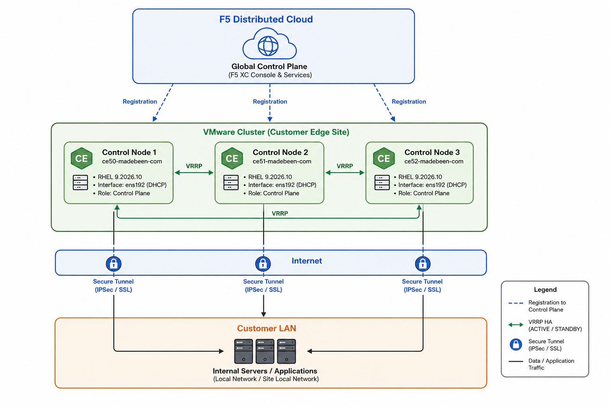
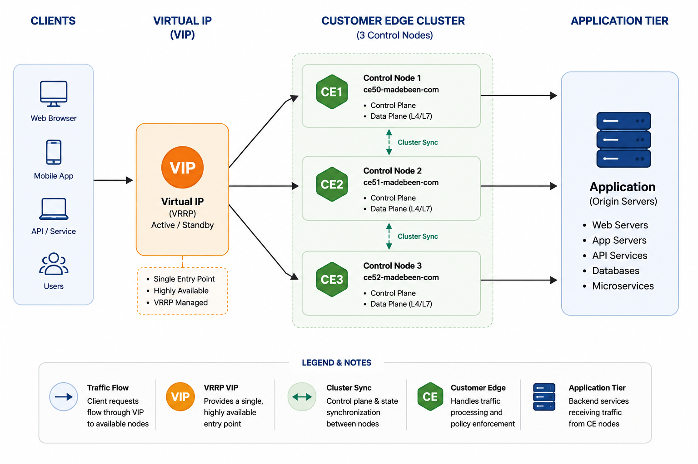
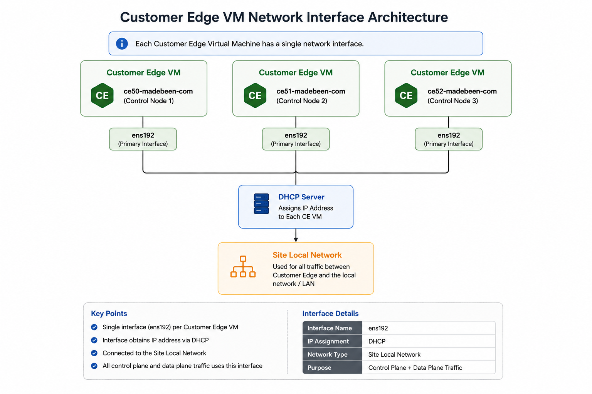
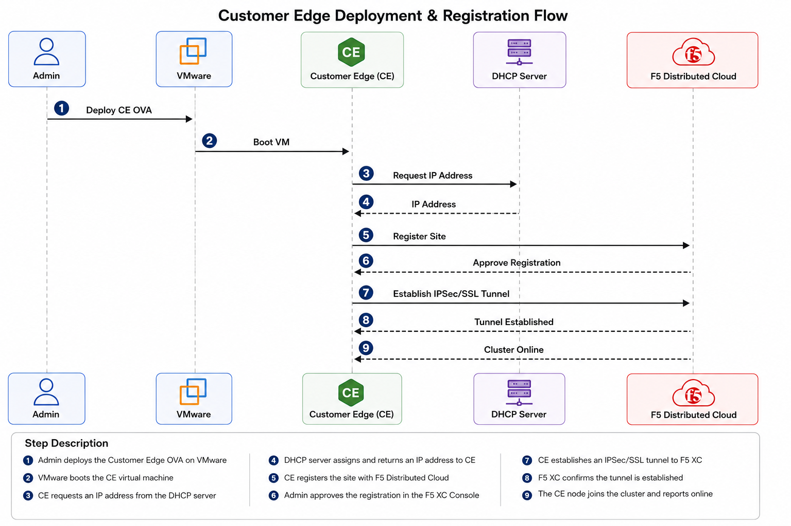
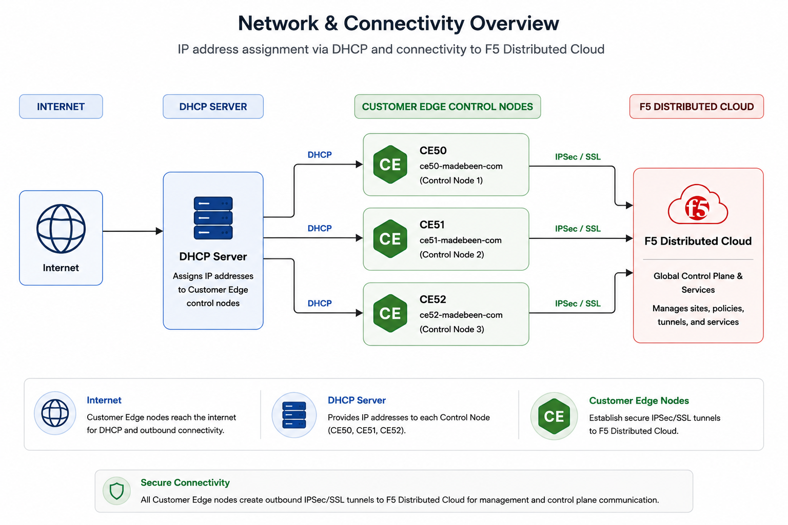
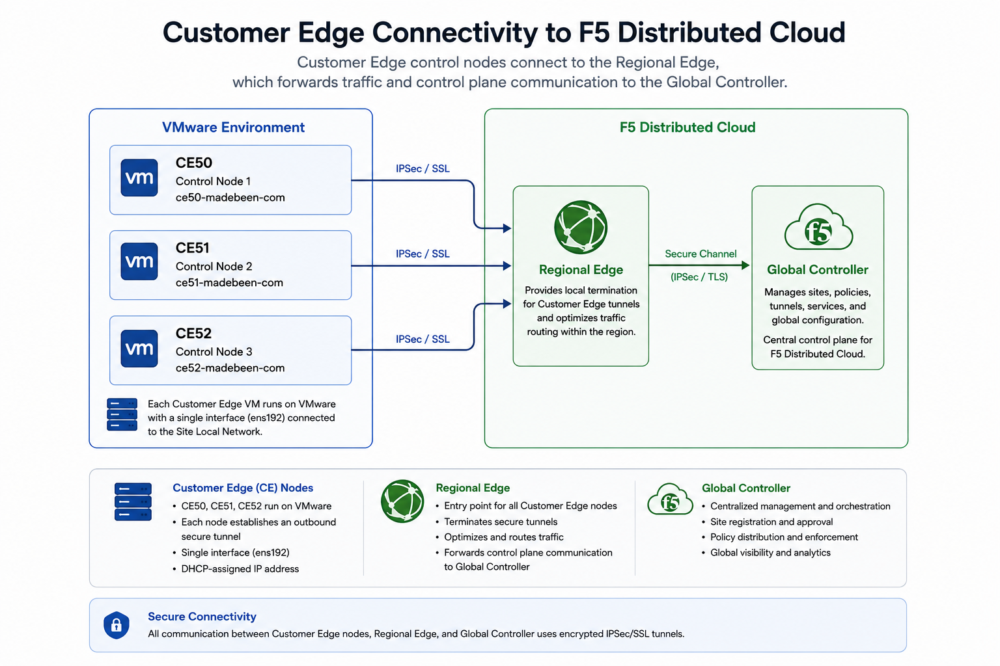

# F5 Distributed Cloud Customer Edge (CE) 3-Node Cluster on VMware

This repository documents the deployment of a **3-node Highly Available Customer Edge (CE) Cluster** running on **VMware** using **F5 Distributed Cloud (XC)**.

The deployment uses three Control Nodes configured in an HA cluster with VRRP enabled, using the default software and operating system versions provided by F5 Distributed Cloud.

---

# Architecture



---

# High Availability



---

# Repository Structure

```
.
├── README.md
├── pictures/
└── scripts/
```

---

# Deployment Topology

Each Customer Edge VM contains a single interface but could have been configured with two or more interfaces.



Node inventory

| Hostname | Type | Interface |
|-----------|------|-----------|
| ce50-madebeen-com | Control | ens192 |
| ce51-madebeen-com | Control | ens192 |
| ce52-madebeen-com | Control | ens192 |

---

# Deployment Flow



---
Notes: Step 6 should happen automatically no manual intervention required for SMSv2

# Prerequisites

Before deployment ensure the following are available.

## VMware

- VMware ESXi
- vCenter (optional)
- VM Network
- DHCP service
- Internet connectivity

## F5 Distributed Cloud

- Tenant
- API Credentials
- Site Token
- CE OVA Image
- Appropriate permissions

---

# Customer Edge Configuration

## Site Information

| Property | Value |
|-----------|-------|
| Platform | VMware |
| Cluster Size | 3 |
| HA | Enabled |
| VRRP | Enabled |
| Tunnel | IPSec or SSL |
| Local VRF | Default |
| Proxy | Disabled |
| Forward Proxy | Disabled |
| Offline Survivability | Disabled |

---

## Software

| Component | Version |
|-----------|----------|
| CE Software | crt-20251002-0028 |
| Operating System | 9.2026.10 |
| Host OS | RHEL 9 (2026.10) |

---

## Performance

- L7 Enhanced Performance Mode
- Jumbo Frames Disabled

---

# Network Configuration

Each node is configured as follows.

| Interface | DHCP | Primary | Management |
|------------|------|----------|------------|
| ens192 | Yes | Yes | No |




---

# Installation Guide

## Step 1

Download the Customer Edge OVA from the F5 Distributed Cloud Console.

---

## Step 2

Deploy three virtual machines.

Example

```
ce50-madebeen-com
ce51-madebeen-com
ce52-madebeen-com
```

---

## Step 3

Allocate resources.

Recommended

| Resource | Value |
|-----------|-------|
| CPU | 4 vCPU |
| Memory | 16 GB |
| Disk | 80 GB |

---

## Step 4

Connect each VM to the Site Local Network.

```
ens192
```

Enable DHCP.

---

## Step 5

Power on each VM.

Verify each machine receives an IP address.

```
ip addr
```

---

## Step 6

Generate a Site Token from the Distributed Cloud Console.

```
Multi-Cloud Network Connect

↓

Manage

↓

Site Management

↓

Site Tokens
```

---

## Step 7

Register the site using the generated token.

The node automatically connects to the Distributed Cloud Regional Edge.

---

## Step 8

Approve the site registration.

```
Manage

↓

Site Management

↓

Registrations
```

Approve the pending registration.

---

## Step 9

Wait for cluster formation.

The three nodes elect a leader and establish HA.

---

## Step 10

Verify connectivity.

Expected status

```
3 Control Nodes

HA Enabled

VPN Established

Online
```

---

# Upgrade Configuration

The cluster uses Kubernetes drain during upgrades.

Current settings

```
Drain Timeout: 300 seconds

Maximum Unavailable Nodes: 1
```

This allows rolling upgrades while maintaining service availability.

---

# Security

Current configuration

- No Forward Proxy
- No URL Categorization
- Default DNS
- Default NTP
- IPSec/SSL encrypted tunnels
- Proxy enabled for XC communication
- Site-to-Site Connectivity

---

# Cluster Components



---

# Configuration Summary

| Setting | Value |
|----------|-------|
| Provider | VMware |
| Site Type | Customer Edge |
| Nodes | 3 |
| Node Role | Control |
| HA | Enabled |
| VRRP | Enabled |
| Tunnel | IPSec or SSL |
| Software Version | crt-20251002-0028 |
| OS Version | 9.2026.10 |
| DHCP | Enabled |
| Local VRF | Default |
| DNS | F5 Default |
| NTP | F5 Default |

---

# Troubleshooting

## Site Registration Failed

Verify

- Internet connectivity
- DNS resolution
- NTP synchronization
- Site Token validity

---

## Tunnel Down

Verify

- Firewall rules
- Outbound HTTPS
- IPSec ports
- Regional Edge reachability

---

## Cluster Not Forming

Verify

- All nodes can reach each other
- Same site token used
- Time synchronization
- DHCP leases
- VMware networking

---

# Useful Commands

Show interfaces

```bash
ip addr
```

Show routes

```bash
ip route
```

Ping Regional Edge

```bash
ping <regional-edge-ip>
```

Check connectivity

```bash
curl https://ves.io
```

---
# general observation and notes

1) Each and every cluster member needs its own token generated.
2) All the cluster members have to be booted up at the same time (installed ahead of time) and booted up simultaneously.
3) CEs use NTP and also needs to be allowed through the firewall for time sync besides all the documented subnets.
4) All the CEs need to come up as control plane in the cluster (that’s what the HA setting does). We also need to enable the HA setting as it is off by default.
5) Registration process has to be automatic. No need to approve anything.

---

# References

- F5 Distributed Cloud Documentation
- Customer Edge Deployment Guide
- VMware Deployment Guide

---

# License

MIT License
